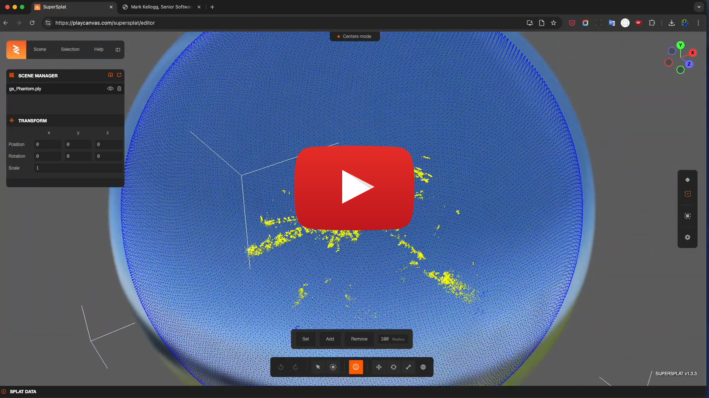

# AIST Cesium Threejs 3DGS

This is the English version of the README.

[日本語版はこちら](README_ja.md)

[[DEMO]](https://hisayan.github.io/cesium-threejs-3dgs/)

## 1. Overview

This is a library to position and display 3D Gaussian Splatting format data on CesiumJS.

## 2. Quick Start

Run a demonstration using this library.

[Node.js](https://nodejs.org/) is required to run.
The operation has been tested on Ubuntu 22.04 LTS and Node.js v18.20.4 (LTS).

We have confirmed that it does not work with Node.js (v12), which can be installed with the standard package of Ubuntu 22.04 LTS.
We have not tested with other versions of Node.js.

The demonstration is performed by executing the following commands in an environment where Node.js is installed.

```shell
$ cp .env.example .env
$ npm run dev
```

It will start on port 5173 of the host on which you run it, so access `http://localhost:5173` with a web browser.

If you need to change the host or port, use `--host` and `--port` to specify as desired.
To change the host to 192.168.0.10 and the port to 18080, specify as follows.

```shell
$ npm run dev -- --host=192.168.0.10 --port=18080
```

If you already have some kind of web server running and want to run it on it, deploy under the `dist` directory contents to any location by executing the following command.

```shell
$ npm run build
```

## 3. Usage

Declare ThreeJS in advance, and call cesiumThreejs3DGS.load3dgs on top of it.

### 3.1. Initialization

Generate CesiumThreejs3DGS with the CesiumJS Viewer as an argument.

```javascript
const viewer = new Cesium.Viewer('cesiumContainer', {
  terrain: Cesium.Terrain.fromWorldTerrain(), {
})

import CesiumThreejs3DGS from '/src/cesium-threejs-3dgs.ts'
const cesiumThreejs3DGS = new CesiumThreejs3DGS(viewer)
```

### 3.2 Loading 3D Gaussian Splatting

Display at any latitude, longitude, and ellipsoid height, given a URL

```javascript
cesiumThreejs3DGS.load3dgs({
  splatUrl: “. /demo/nakajima.ksplat”,
  lat: 33.973, lon: 132.630
  lon: 132.63026,
  lat: 33.973, lon: 132.63026, height: 40,
  headingPitchRoll: { heading: 37, pitch: 180, roll: 0 }, scale: 45, lon: 132.63026, height: 40,
  scale: 45,
  camera: {
    offset: { x: 150, y: -70, z: 30 }, headingPitchRoll: { heading: 37, pitch: 180, roll: 0 }, scale: 45, camera: {
    headingPitchRoll: { heading: -20, pitch: -10, roll: 0 }
  }
})
````

| Parameter | Purpose
| --- | --- |
| `splatUrl` | The URL of the 3DGS
| `lat` | The latitude to place.
| `lon` | The longitude to place.
| `height` | Height of the ellipsoid to place.
| `height` | height of the ellipsoid to place. This is specified in degrees and conforms to CesiumJS.
| `scale` | The scale at which to place the image. The format {x: 5, y: 5, z: 5} is also supported.
| `camera.offset` | camera position after displaying (optional)
| `camera.headingPitchRoll` | set the angle of view of the camera after display (optional)

### 3.3 Deleting Scenes

When loading a new 3DGS, you need to delete the loaded scene.

```javascript
await cesiumThreejs3DGS.remove3dgsAll()
````

### 4. Prepping the 3DGS data

Depending on the tool used to generate the 3DGS scene, there may be cases where the scene is complemented with a Skybox-like sphere.

In such a case, CesiumJS will look at the “sphere” from a distance as if you were looking at it from the outside. In this case, you may want to consider removing the “sphere” by editing it in advance.

[](https://youtu.be/rEvuZaIcKDU)

This video's guidance is in Japanese only.

### 5. Scanning application to create 3D Gaussian Splatting (Ref.)

+ [Luma AI Interactive Scenes](https://lumalabs.ai/interactive-scenes)

+ [Scaniverse](https://scaniverse.com/)

## 6. Known bugs etc.

### SharedMemory and GPU are not used.

+ [CORS and SharedArryBuffer relationship is still developing](https://github.com/mkkellogg/GaussianSplats3D?tab=readme-ov-file#cors-issues-and- sharedarraybuffer)
+ SharedMemory and GPU are not used for this reason.

### Multiple 3DGS scene display is not supported.

+ The 3D Gaussian splatting for Three.js library we use supports multiple scene rendering, but if you use it with large x, y, z coordinates in Three.js (such as earth-centered coordinate system), there is a [known bug that causes rendering errors](https https://github.com/mkkellogg/GaussianSplats3D/issues/336).
+ The coordinate transformation is performed at a higher level, targeting only one scene.
+ The SplatViewer is destroyed each time when a scene is unloaded.

## 7. License

- This software is open source software provided under the MIT License.
- The copyright of the source code and related documents belongs to National Institute of Advanced Industrial Science and Technology (AIST).
- This software is developed by [Another Brain Inc.](https://www.anotherbrain.co.jp/).

## 8. Cautions

- The operation of this Repository and the Software is not guaranteed.
- Neither the developer nor AIST shall be liable for any loss or damage arising from the use of this Repository or the Software.
- The contents of this repository are subject to change or deletion without notice.

